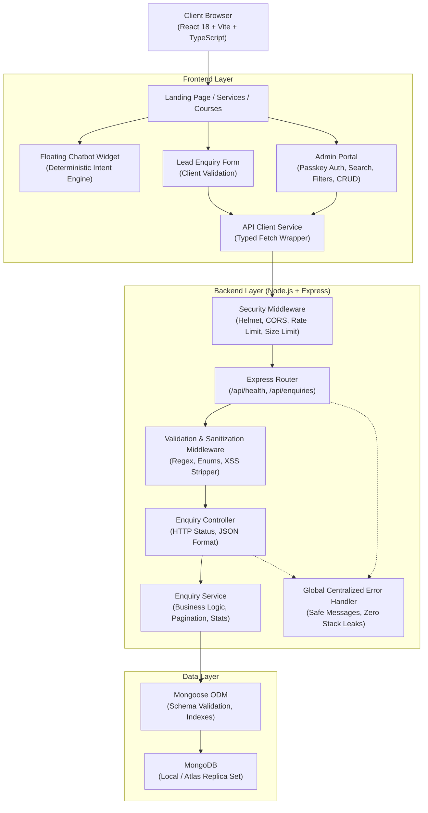
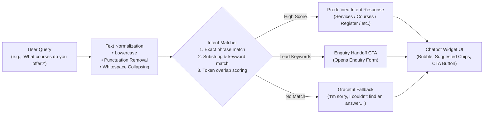

# DroneTV Full-Stack Architecture Documentation

Technical blueprint and architectural rationale for the **DroneTV AI Support & Lead Assistant** application.

---

## 1. System Architecture Overview

---

## 2. Request Lifecycle: How an Enquiry Travels from React to MongoDB

1. **User Interaction**: The visitor fills out the enquiry form (or clicks a prefilled course/service CTA).
2. **Client-Side Validation**: `validateEnquiryForm` immediately validates string lengths, regex patterns, and required fields. If invalid, field-level error messages display without submitting.
3. **HTTP Dispatch**: The frontend `api.submitEnquiry` makes an asynchronous `POST` request with JSON payload to `/api/enquiries`.
4. **Security Filter**: `helmet` verifies headers, `cors` verifies origin permissions, and `express-rate-limit` confirms rate thresholds.
5. **Backend Validation & Sanitization**:
   - `validateCreateEnquiry` strips HTML/script tags to prevent XSS.
   - Strictly validates email and phone regexes.
   - Discards any client-supplied `status` field, guaranteeing `status` is set to `'New'`.
6. **Controller Dispatch**: `EnquiryController.create` passes clean data to `EnquiryService.createEnquiry`.
7. **Database Persistence**: Mongoose validates against the `Enquiry` schema, assigns an `_id` and timestamps (`createdAt`, `updatedAt`), and saves to MongoDB.
8. **Standardized Response**: Controller formats `{ success: true, message: "Enquiry submitted successfully", data: {...} }` with HTTP status `201 Created`.
9. **UI Feedback**: React clears form inputs and displays a green success banner with the generated enquiry ID.

---

## 3. Chatbot Architecture: Deterministic Rule-Based Engine

### Deterministic Design Highlights
- **No External LLM Dependency**: Zero third-party API latency, zero rate-limit charges, zero hallucinations.
- **Intent Knowledge Base**: Supports all mandatory prompt questions:
  - *What services does DroneTV provide?*
  - *What courses / training are available?*
  - *How can I contact DroneTV?*
  - *How can I register?*
  - *I am interested in a service.*
  - *I am a student.*
  - *I want to speak with someone.*
- **Enquiry Handoff**: Whenever user queries imply commercial interest ("hire drone", "pricing", "admission"), the engine provides an embedded *"Submit an Enquiry"* button that automatically navigates to `/enquire` with the interest preselected.

---

## 4. Security & Error Handling Architecture

1. **Defense-in-Depth Validation**:
   - Never trust client inputs: Validation is replicated on both the frontend and backend.
   - Server-side sanitization strips dangerous tags from all strings.
2. **Safe Error Masking**:
   - The global centralized error handler intercepts unhandled exceptions, Mongoose `CastError`, validation errors, and JSON parse errors.
   - **Zero Technical Leaks**: Internal stack traces, database credentials, and `MongoServerError` strings are strictly kept within server console logs and never transmitted to client JSON payloads.
3. **Rate Limiting & Body Limits**:
   - IP-based rate limiting (300 requests per 15-minute window).
   - Payload limit capped at `50kb` to protect against payload memory exhaustion attacks.
4. **Administrative Protection**:
   - Admin routes require passkey authentication (`dronetv2026`) stored in browser session storage, preventing casual public exploration.

---

## 5. Candidate Interview Q&A Guide

When discussing this architecture in an interview, be prepared with these rationales:

### Why React?
Component-driven modularity allows isolating reusable building blocks (Cards, Forms, Chatbot, Modals) and managing responsive UI state reactively without manual DOM manipulation.

### Why TypeScript?
Provides end-to-end type safety, autocompletion, and compile-time error detection. Shared models prevent mismatch between API responses and frontend state.

### Why Express?
Minimalist, unopinionated, high-performance Node.js framework with rich middleware ecosystem (Helmet, CORS, rate limiting) providing transparent control over HTTP routes.

### Why MongoDB & Mongoose?
Document structure aligns natively with JSON payloads. Flexible schemas allow fast iteration, while Mongoose provides strict schema enforcement, hooks, and built-in indexing.

### Why REST Conventions?
Clear HTTP semantics (`GET` for reading, `POST` for creation, `PATCH` for updates, `DELETE` for removal) make APIs intuitive, discoverable, and easily cacheable.

### Why Frontend + Backend Validation?
Frontend validation provides instant user feedback and superior UX. Backend validation provides absolute security against malicious, bypassed, or script-automated requests.

### Why Controller / Service Separation?
Decouples transport logic (HTTP request/response handling) from business logic and database persistence. Services can be independently tested, reused, or migrated.
