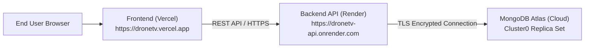

# Production Deployment Guide — DroneTV AI Support & Lead Assistant

This guide provides step-by-step instructions for deploying the **DroneTV AI** full-stack application to production using standard cloud services:
- **Database**: MongoDB Atlas (Free Tier M0 Replica Set)
- **Backend API**: Render (or Railway)
- **Frontend Portal**: Vercel (or Netlify)

---

## 🏗️ Architecture Overview



---

## Step 1: Deploy Database (MongoDB Atlas)

1. Navigate to [MongoDB Atlas](https://www.mongodb.com/cloud/atlas) and sign in.
2. Click **Build a Database** and select the free **M0 Shared Cluster**.
   - Cloud Provider: **AWS**
   - Region: **Mumbai (`ap-south-1`)** (recommended for Indian sub-millisecond latency).
3. **Create Database User**:
   - Go to **Security** -> **Database Access** -> **Add New Database User**.
   - Authentication Method: **Password**.
   - Username: `dronetv_admin`
   - Password: `<Generate a strong password and save it>`
   - Database User Privileges: `Read and write to any database`.
4. **Configure IP Access**:
   - Go to **Security** -> **Network Access** -> **Add IP Address**.
   - Select **Allow Access from Anywhere** (`0.0.0.0/0`) so dynamic cloud server IPs (Render/Railway) can connect.
5. **Copy Connection String**:
   - Click **Database** -> **Connect** -> **Drivers (Node.js)**.
   - Copy the URI format:
     ```env
     mongodb+srv://dronetv_admin:<PASSWORD>@cluster0.abcde.mongodb.net/dronetv_db?retryWrites=true&w=majority
     ```
   - Replace `<PASSWORD>` with your database password and ensure the DB name is `dronetv_db`.

---

## Step 2: Deploy Backend API (Render)

1. Sign in to [Render](https://render.com/).
2. Click **New +** -> **Web Service**.
3. Connect your GitHub / GitLab repository containing `DroneTV-AI`.
4. Configure the service parameters:
   - **Name**: `dronetv-backend-api`
   - **Region**: `Singapore` or closest to India
   - **Root Directory**: `backend`
   - **Runtime**: `Node`
   - **Build Command**: `npm install`
   - **Start Command**: `npm start`
   - **Plan**: `Free`
5. **Configure Environment Variables** (Under the "Environment" tab):
   | Variable Key | Recommended Value | Note |
   | :--- | :--- | :--- |
   | `NODE_ENV` | `production` | Enables production caching & security |
   | `PORT` | `5000` | (Render automatically routes this) |
   | `MONGODB_URI` | `mongodb+srv://dronetv_admin:...` | Your MongoDB Atlas URI from Step 1 |
   | `CLIENT_URL` | `http://localhost:5173` | Temporary until Frontend is deployed |
   | `ADMIN_API_KEY` | `dronetv_admin_secure_2026` | Internal admin authorization secret |
6. Click **Deploy Web Service**.
7. Once deployed, note down your live Backend URL:
   - Example: `https://dronetv-backend-api.onrender.com`
8. Verify health status in your browser:
   - Visit: `https://dronetv-backend-api.onrender.com/api/health`
   - Expected Response:
     ```json
     {
       "success": true,
       "message": "API is running",
       "database": "connected",
       "environment": "production"
     }
     ```

---

## Step 3: Deploy Frontend (Vercel)

1. Sign in to [Vercel](https://vercel.com/).
2. Click **Add New...** -> **Project**.
3. Import the same `DroneTV-AI` repository.
4. Configure project settings:
   - **Framework Preset**: `Vite`
   - **Root Directory**: Click *Edit* and select **`frontend`**.
   - **Build Command**: `npm run build`
   - **Output Directory**: `dist`
5. **Configure Environment Variables**:
   | Variable Key | Value | Description |
   | :--- | :--- | :--- |
   | `VITE_API_BASE_URL` | `https://dronetv-backend-api.onrender.com` | Your live Render Backend URL (no trailing slash) |
   | `VITE_ADMIN_KEY` | `dronetv2026` | Passkey for `/admin` CRM dashboard |
6. Click **Deploy**.
7. Once finished, Vercel will assign a production domain:
   - Example: `https://dronetv-ai.vercel.app`
8. Note: `frontend/vercel.json` is already configured in the repo with client-side rewrite rules, guaranteeing direct visits to `/courses`, `/services`, `/enquire`, or `/admin` will not result in 404 errors on reload.

---

## Step 4: Final Handshake (Update CORS)

1. Return to your **Render** dashboard for `dronetv-backend-api`.
2. Go to **Environment Variables**.
3. Update `CLIENT_URL` to your production Vercel domain:
   ```env
   CLIENT_URL=https://dronetv-ai.vercel.app
   ```
4. Click **Save Changes** (Render will automatically redeploy with the updated CORS policy).

---

## Step 5: Verification Checklist

- [ ] Visit `https://your-frontend.vercel.app/`
- [ ] Open the floating Chatbot and ask: *"What services does DroneTV provide?"*
- [ ] Submit an enquiry lead on `/enquire`
- [ ] Log in to `/admin` using passkey `dronetv2026`
- [ ] Verify the new lead appears with status `'New'` in real time
- [ ] Test status change (`Contacted`, `In Progress`, `Closed`) and CSV export
